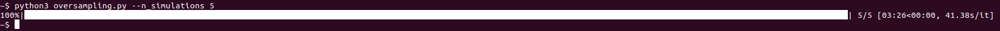
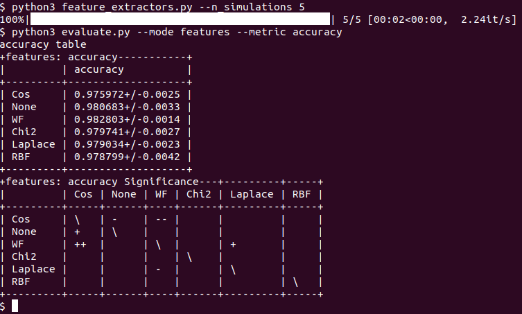

# HeadacheDSS

This repository contains all the code required to reproduce all knowledge incorporation experiments given in the paper: 
'A decision support system to follow up and diagnose chronic primary headache patients using semantically enriched data'. 

It consists of a larger `SemanticProcessor` and `WFL` module and two scripts (`oversampling.py` and `feature_extraction.py`) 
to generate predictions for different over-sampling techniques and different feature extraction techniques. The 
predictions are stored in the output folder, which can then be processed in order to calculate different metrics 
(such as accuracy and Cohen's Kappa score) followed by bootstrap testing in order to test statistical significance.

### 1. Installing all dependencies

The code can be run with Python3. All dependencies can easily be installed as follows: 

`(python3 -m) pip install -r requirements.txt`

### 2. Generating the Knowledge Base with the SemanticProcessor

All code to convert the migbase feature matrix to a knowledge graph, and vice versa can be found in the `SemanticProcessor` module. In order to generate the migbase knowledge graph and a knowledge graph based on the ICHD document, just run

`python3 generate_semantic_data.py`

### 3. Over-sampling with prior knowledge vs ADASYN, SMOTE and weighted samples

In order to reproduce the results from the overbalancing experiment, where multiple techniques to combat data imbalance (which occurs when the classifiers the majority class, with the most samples) are compared. We compare the baseline (where no extra technique is applied) with [SMOTE](https://www.jair.org/media/953/live-953-2037-jair.pdf), [ADASYN](http://sci2s.ugr.es/keel/pdf/algorithm/congreso/2008-He-ieee.pdf), using adjusted weights for samples from the minority class in the split criterion and with sampling data using the prior knowledge using the generated ICHD KG. We fit the sklearn [DecisionTreeClassifier](http://scikit-learn.org/stable/modules/generated/sklearn.tree.DecisionTreeClassifier.html) after pre-processing. By running `python3 oversampling.py --n_simulations <N>`, prediction files are generated (corresponding to the different techniques). Each time, a different split is used in the cross-validation scheme. The prediction files will be stored in `output/oversampling/<TECHNIQUE>`.

### 4. Generating unsupervised features with the Weisfeiler-Lehman kernel

First, generate the features that express the distance (in the graph domain) to each class concept, using the Weisfeiler-Lehman kernel. To do this, run 

`python3 generate_features.py`

Afterwards, generate prediction files again (stored in output/features/<TECHNIQUE>), by running

`python3 oversampling.py --n_simulations <N>`

### 5. Evaluating the generated prediction files

After generating prediction files, they can be generated by the `evaluate.py` script. It will generate a table with both the mean and stddev of a certain metric, and apply bootstrap significance testing.

```
Usage: evaluate.py [OPTIONS]

Options:
  --mode TEXT    The mode to use: either "oversampling", "features" or "both"
  --metric TEXT  The metrics to calculate: either "all" or one from
                 ["accuracy", "kappa", "f1_cluster", "f1_tension",
                 "f1_migraine"]
  --help         Show this message and exit.
```

### 6. Examples

1. Generating results for over-sampling methods



2. Generating results for feature extraction methods (this requires `wf_features.p` to be in the `data/` directory)



### 7. Contact

In case there are any problems with the code, please create an issue. You can always contact me at gilles.vandewiele (at) ugent (dot) be if needed.
